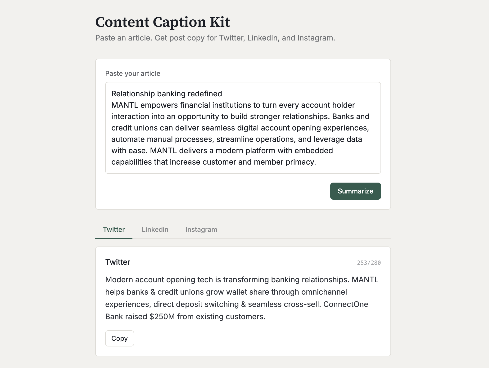

# Caption Kit



Paste in an article and get ready-to-post captions for Twitter/X, LinkedIn, and Instagram — tailored to each platform's tone and character limits.

**[Live demo →](https://content-summarizer-dcn8cvq8l-alk2.vercel.app/)

## What it does

Long-form content (articles, blog posts, announcements) doesn't map cleanly to social media. Caption Kit takes a pasted article and generates three platform-specific captions in one pass, so you're not manually rewriting the same idea three different ways.

- Validates input length before sending it anywhere
- Enforces Twitter/X's 280-character limit server-side, even if the model overshoots
- Copy-to-clipboard on each result, with live character counts per platform

## How it works

The frontend is a static React app. When you hit "Summarize," it calls a Vercel serverless function (`/api/summarize`), which is the only place the Anthropic API key ever lives — it's never exposed to the browser. That function calls Claude, asks for structured JSON output (one field per platform), and returns it to the frontend for display.


Run with Vercel's dev server (needed so the `/api` function works locally, not just the frontend):
```bash
vercel dev
```

## Author

**Hunter Tigert** — [huntertigert.com](https://huntertigert.com) · [LinkedIn](https://www.linkedin.com/in/hunter-tigert)